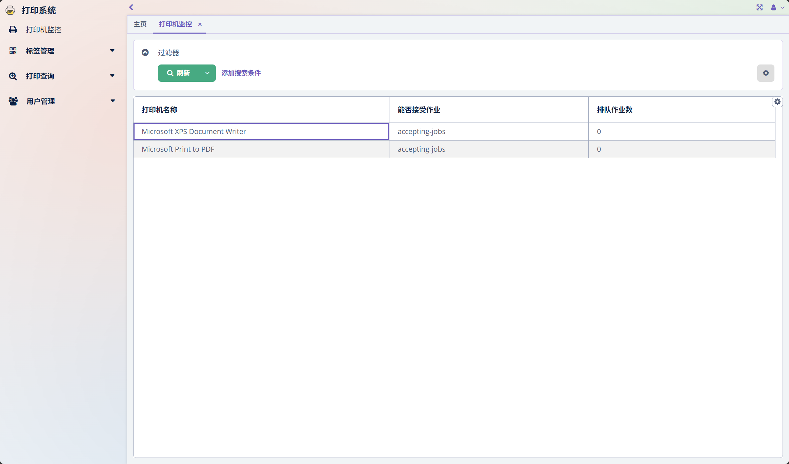
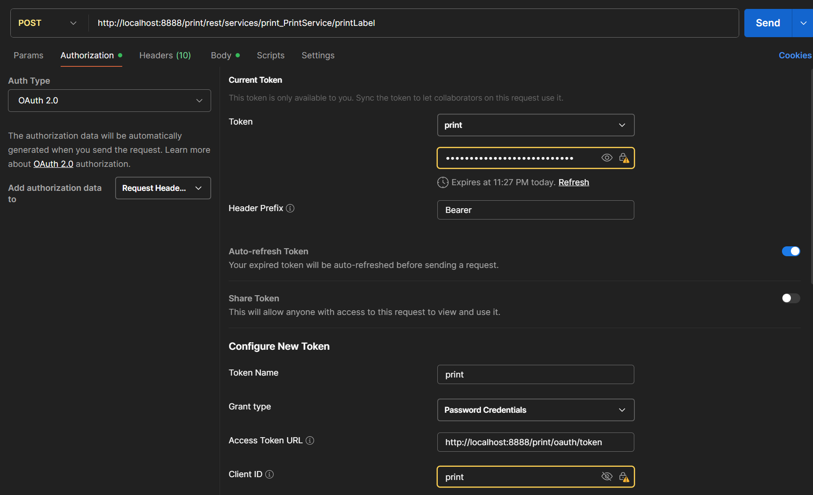
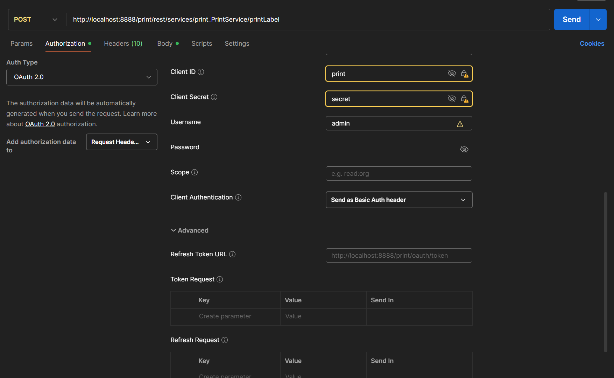
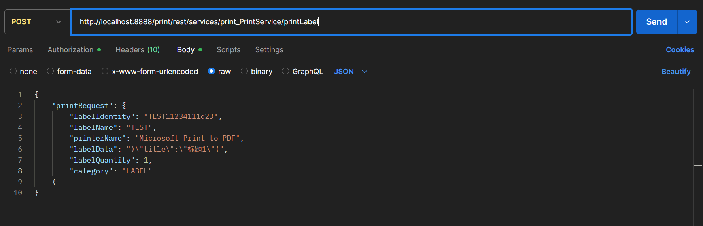

# x-print
***
- 基于Jmix构建的打印系统
- 当前已实现通过java画图打印标签，已集成POITL框架，可通过Word模板实现打印。
- 后续可以集成codesoft、ireport等画模板实现打印。

## 打印机
    要实现打印，必须在部署打印服务的系统中安装打印机驱动，保证打印机正常连接。配置好的打印机，可以在打印机监控页面中查看。



## 接口
    打印实现方式为，通过REST接口发送打印数据到该打印系统中，参数中需要包含打印标签名称、打印机名称等。打印系统接收到数据后会保存到数据库中。
    
    打印系统轮询从队列中获取打印任务，读取打印标签模板，填充数据，然后发送到打印机执行打印。如果标签模板不存在，会一直报错，直到解决问题，否则不能进行后面的打印。

### PostMan调用接口

    


请求参数

``` 
{
        "printRequest": {
        "labelIdentity": "TEST11234111q23",
        "labelName": "TEST",
        "printerName": "Microsoft Print to PDF",
        "labelData": "{\"title\":\"标题1\"}",
        "labelQuantity": 1,
        "category": "LABEL"
        }
  } 
```
  

## POITL框架

    https://deepoove.com/poi-tl/

